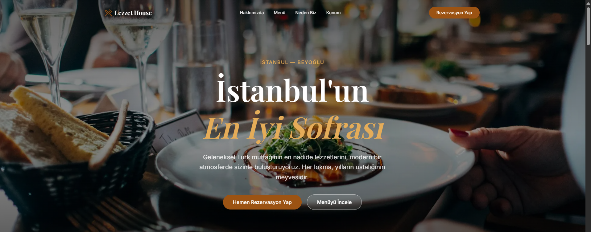
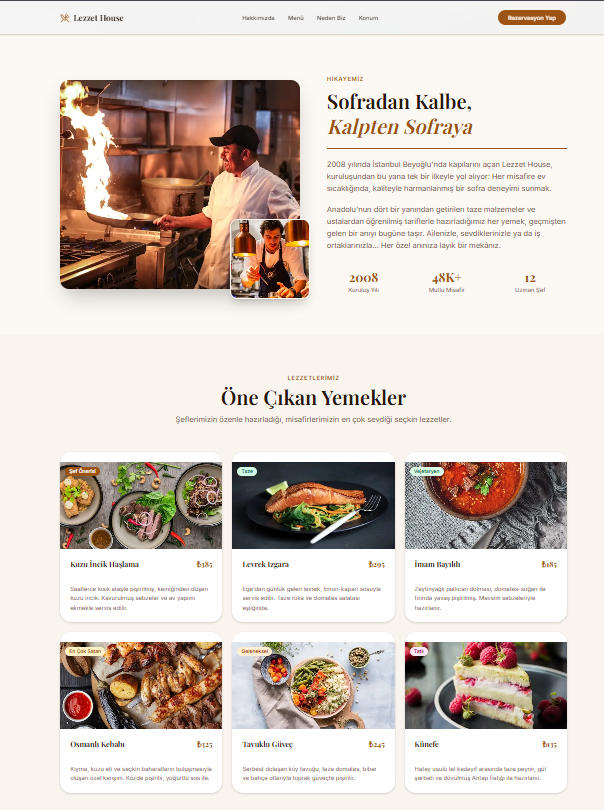
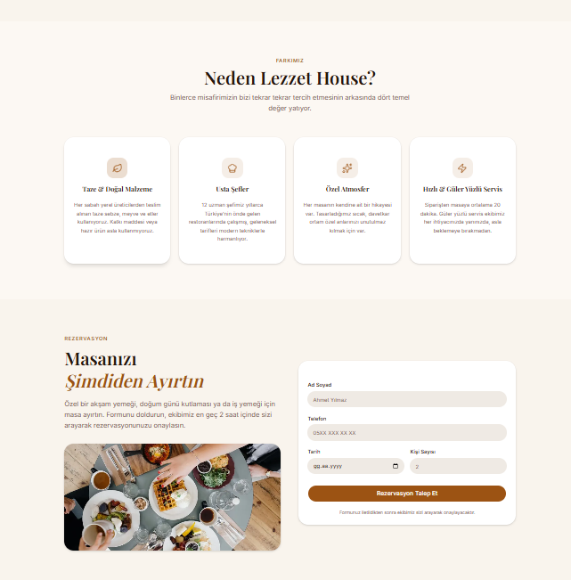

# 🍽️ Lezzet House — Restaurant Website

A modern, elegant restaurant landing page with reservation system, menu showcase, and location information.

## 🔗 Live Demo
[restoran-sitesi.vercel.app](https://restoran-sitesi.vercel.app)

## 📷 Screenshots





## ✨ Features
- Elegant hero section with reservation CTA
- Interactive menu showcase
- Location & contact information
- Mobile responsive design
- Google Maps integration

## 🔒 Security
- Mozilla Observatory **A+** — 10/10 tests passed
- Google PageSpeed **100/100**

## 🛠️ Tech Stack
- Next.js 15
- TypeScript
- Tailwind CSS
- Vercel

## 🚀 Getting Started
```bash
git clone https://github.com/FatihEmreBARUTCU0/restoran-sitesi
cd restoran-sitesi
npm install
npm run dev
```
